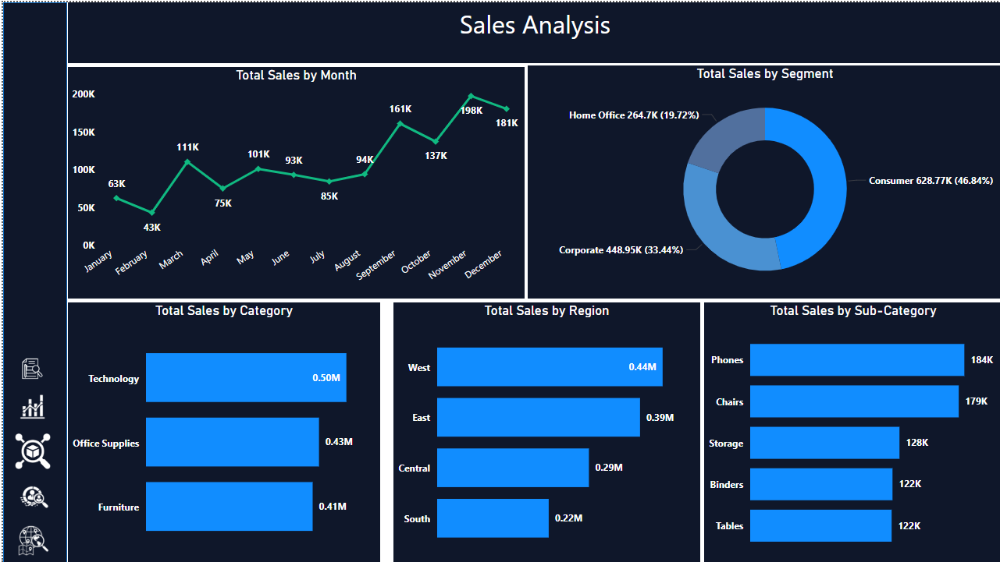
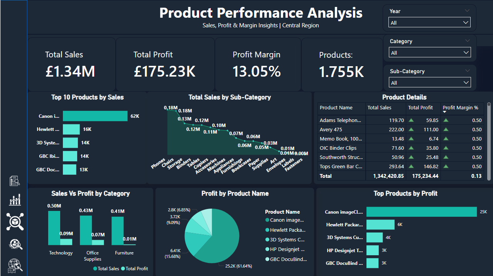
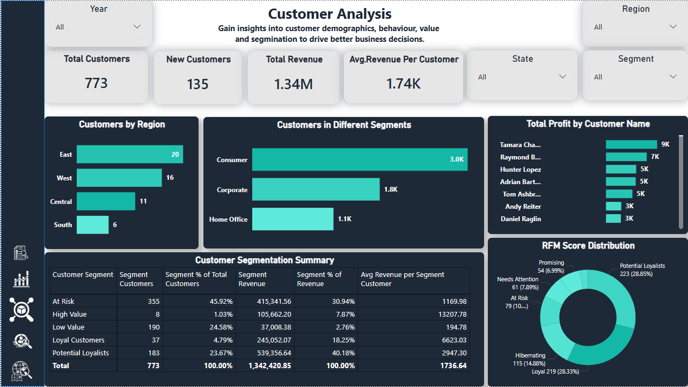
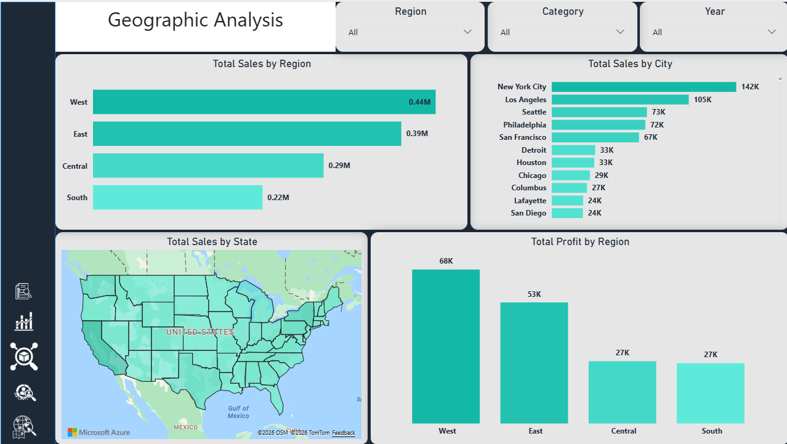

# Sales Dashboard Using Power BI
## Project Overview

This project is an interactive **Sales Dashboard built in Power BI**. The dashboard analyzes sales performance, product performance, customer behavior, and geographic sales trends using a retail sales dataset.

The main goal of this project is to turn raw sales data into clear business insights that can help understand revenue performance, customer segments, profitable products, and regional sales opportunities.

## Dashboard Pages

The Power BI report contains the following pages:

1. **Overview Dashboard**

   * Total Sales
   * Total Profit
   * Total Orders
   * Profit Margin
   * Average Order Value
   * Sales trend overview

2. **Sales Analysis**

   * Monthly sales trend
   * Sales by region
   * Sales by category
   * Sales by customer segment

3. **Product Analysis**

   * Top products by sales
   * Top products by profit
   * Sales by category
   * Sales by sub-category

4. **Customer Analysis**

   * Total customers
   * Average revenue per customer
   * Sales by customer segment
   * Customer contribution analysis

5. **Geographic Analysis**

   * Sales by city
   * Sales by region
   * Profit by region
   * Top-performing locations

## Tools and Technologies Used

* Power BI Desktop
* Power Query
* DAX
* Data Modeling
* Data Cleaning
* Data Visualization
* Git and GitHub

## Key KPIs

The dashboard includes the following key performance indicators:

* Total Sales
* Total Profit
* Total Orders
* Profit Margin %
* Average Order Value
* Total Customers
* Repeat Customers
* Sales Growth %

## Key Insights

* The dashboard shows total sales of approximately **£1.34M** and total profit of around **£175K**.
* The overall profit margin is approximately **13.05%**, which shows the business is profitable but still has room to improve.
* **November** recorded the highest monthly sales, followed by **December** and **September**.
* The **West region** generated the highest sales and profit compared to other regions.
* **Technology** was the strongest product category by sales.
* **Phones** and **Chairs** were among the top-performing sub-categories.
* The **Consumer segment** contributed the highest share of sales.
* Cities such as **New York City, Los Angeles, Seattle, Philadelphia, and San Francisco** showed strong sales performance.
* The **South region** had lower sales performance compared to other regions and may need more business focus.

## Business Recommendations

Based on the dashboard analysis:

* The business should focus more on high-performing regions such as the West and East.
* More marketing and sales effort should be applied in lower-performing regions such as the South.
* Technology products should be prioritized because they generate strong revenue.
* Customer retention strategies should be improved to increase repeat customers.
* Top-performing cities should be studied further to understand what drives stronger sales in those locations.

## Screenshots

### Overview Dashboard


### Sales Analysis



### Product Analysis



### Customer Analysis



### Geographic Analysis



## Project Files

```text
sales-dashboard/
│
├── README.md
├── sale_dashboard.pbix
├── screenshots/
│   ├── overview.png
│   ├── sales-analysis.png
│   ├── product-analysis.png
│   ├── customer-analysis.png
│   └── geographic-analysis.png
└── dataset/
    └── sample-superstore.csv
```

## How to Open the Project

1. Download or clone this repository.
2. Open the `.pbix` file using Power BI Desktop.
3. Review the dashboard pages and interact with the visuals.
4. Use filters and slicers to explore sales, product, customer, and geographic performance.

## About This Project

This project was created as part of my data analytics portfolio to demonstrate skills in Power BI dashboard development, DAX measures, data visualization, business analysis, and insight generation.

## Author

**Ram Thapa**
Data Analytics Student | Power BI | SQL | Python | Data Visualization

